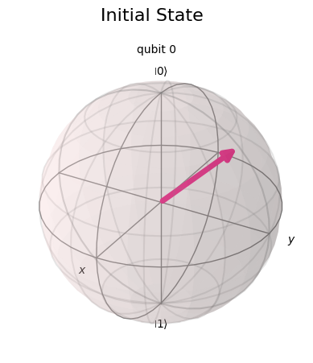

# 量子ビット
## 情報の基本単位
- 古典コンピュータ: 0, 1 の bit
- 量子コンピュータ: $ \ket{0}, \ket{1} $ に対応して qubit と呼ばれる

qubit は複素ベクトルによって記述される．このベクトルのことを状態ベクトルと呼ぶ．古典ビットと異なり $ \ket{0}, \ket{1} $ じゃない状態も取れる．例えば $ \ket{\psi} = \alpha\ket{0} + \beta\ket{1} $ などで，この $ \ket{0}, \ket{1} $ の線型結合で与えられる qubit を重ね合わせ状態と呼ぶ．

## 1 qubit
1 qubit は 2 次元の複素ベクトル空間上のベクトルで表現される．なので，2 つの基底ベクトルが存在して，
$$
\ket{0} \coloneqq (1, 0)^\top, \ket{1} \coloneqq (0, 1)^\top
$$
で定義される．この基底の取り方を標準基底と呼んで，正規直交基底になっている．

1 qubit は標準基底 $\ket{0}, \ket{1} $ と $ \alpha^2 + \beta^2 $ を満たすような複素数 $ \alpha, \beta $ を用いて $ \alpha\ket{0} + \beta\ket{1} $ という状態を取る．なので，ベクトルの要素を書くと
$$
\ket{\psi} = \alpha\ket{0} + \beta\ket{1} = \alpha (1, 0)^\top + \beta (0, 1)^\top = (\alpha, \beta)^\top
$$
となる．ただし，$ \alpha^2 + \beta^2 = 1 $ になる．

複素数 $ \alpha, \beta $ に注目すると，$ |\alpha| \geq 0, |\beta| \geq 0$ で $ |\alpha|^2 + |\beta|^2 = 1 $なので $ 0 \leq \theta \leq \frac{\pi}{2} $ となる $ \theta $ を用いて $ |\alpha| = \cos \theta, |\beta| = \sin \theta $ とすることができる．

そして $ \alpha, \beta$ は複素数なので $ 0 < \phi_\alpha < \phi_\beta < 2\pi $ を満たす $ \phi_\alpha, \phi_\beta $ を用いて，$ \alpha = \exp(i\phi_\alpha)\cos\theta, \beta = \exp(i\phi_\beta)\sin\theta $ と表すことができる．これを用いて $ \ket{\psi} $ を表示すると
$$
\begin{align*}
\ket{\psi} & = \exp(i\phi_\alpha)\ket{0} + \exp(i\phi_\beta)\ket{1} \\
& = \exp(i\phi_\alpha)(\cos\theta\ket{0} + \exp(i(\phi_\beta - \phi_\alpha))\sin\theta\ket{1})
\end{align*}
$$
となる．式を整理するために $ \phi_\alpha = \lambda, \phi_\beta - \phi_\alpha = \phi $ と置くと $ \phi_\alpha, \phi_\beta $ の定義から $ 0 \leq \lambda, \phi < 2\pi $ を満たすことが分かる．また，$ \theta $ も次の議論のために $ \theta = \frac{\theta}{2} $ として $ 0 \leq \theta \leq \pi $ とした．従って，
$$
\ket{\psi} = \exp(i\lambda)(\cos(\frac{\theta}{2})\ket{0} + \exp(i\phi)\sin(\frac{\theta}{2})\ket{1})
$$
となる．この $ \ket{\psi} $ における $ \phi $ を位相，$ \lambda $ をグローバル位相と呼ぶ．グローバル位相の項は全体にかかっているので Bloch 球上の位置に影響しない．ここで登場した Bloch 球とは $ xyz $ 空間を考えたときに $ z $ 軸の正の方向に $ \ket{0} $ を負の方向に $ \ket{1} $ を置いた，下のような図である．

$ z $ 軸から $ \theta $ 回転させ，$ x $ 軸から反時計回りに $ \phi $ 回転させた点を $ \ket{\psi} $ として対応させる．上の図の場合だと

となる．ただし，前述の通りグローバル位相は Bloch 球上の位置に影響しないので省略した．Bloch 球を可視化するコードは[ここ]()を参照．

$ (\theta, \phi) = (0, 0), (\pi, 0) $ を代入すると，それぞれ $ \ket{\psi} = \ket{0}, \ket{\psi} = \ket{1} $ となることが分かる．他の値を代入してみると $ (\theta, \phi) = (\frac{\pi}{2}, 0), (\frac{\pi}{2}, \pi) $ を代入するとこれは $ x $ 軸であり，それぞれ $ \ket{\psi} = \frac{1}{\sqrt{2}}\ket{0} \pm \frac{1}{\sqrt{2}}\ket{1} $ となり，これらは $ \ket{+}, \ket{-} $ と呼ばれる． $ (\theta, \phi) = (\frac{\pi}{2}, \frac{\pi}{2}), (\frac{\pi}{2}, \frac{3}{2}\pi) $ を代入すると，$ y $ 軸となり，それぞれ $\ket{\psi} = \frac{1}{\sqrt{2}}\ket{0} \pm \frac{1}{\sqrt{2}}i\ket{1} $ となり，$ \ket{+i}, \ket{-i} $ jと呼ばれる．これらの 3 つを基底に取ったときは，それぞれ
- $\{ \ket{0}, \ket{1} \} $: 計算基底
- $\{ \ket{+}, \ket{-} \} $: アダマール基底
- $\{ \ket{+i}, \ket{i-} \} $: 円基底
と呼ばれていて，どれも正規直交基底である．

## 複数の qubit
次に 2 つの qubit について考える．古典ビットの場合は 2 つのビットで 4 つの状態 $ 00, 01, 10, 11 $ を表現できる．qubit をこれに対応させると $ \ket{00}, \ket{01}, \ket{10}, \ket{11} $ に対応する．1 つの qubit のときと同じように基底ベクトルを考えると，テンソル積を用いて，それぞれ
$$
\begin{align*}
\ket{00} & = \ket{0} \otimes \ket{0} = (1, 0)^\top \otimes (1, 0)^\top = (1, 0, 0, 0)^\top \\
\ket{01} & = \ket{0} \otimes \ket{1} = (1, 0)^\top \otimes (0, 1)^\top = (0, 1, 0, 0)^\top \\
\ket{10} & = \ket{1} \otimes \ket{0} = (0, 1)^\top \otimes (1, 0)^\top = (0, 0, 1, 0)^\top \\
\ket{11} & = \ket{1} \otimes \ket{1} = (0, 1)^\top \otimes (0, 1)^\top = (0, 0, 0, 1)^\top \\
\end{align*}
$$
となる．これらのベクトルも 1 qubit の場合と同様に正規直交基底をなしている．2 つの qubit の場合の状態ベクトル $ \ket{\psi} $ は，$ \sum_i |c_i^2| = 1 $ を満たす複素数 $ c_0, c_1, c_2, c_3 $ を用いて
$$
\begin{align*}
\ket{\psi} & = c_0\ket{00} + c_1\ket{01} + c_2\ket{10} + c_3\ket{11} \\
& = (c_0, c_1, c_2, c_3)^\top
\end{align*}
$$
と表される．

一般に n 個の qubit の場合を考える．$ n $ 古典ビットの表現を qubit を用いると， $ n $ 個の基底のテンソル積を取ることになるから $ 2^n $ 個の状態に対応することが分かる．なので，2 つの qubit のときと同様に
$$
\begin{align*}
\ket{00\cdots 00} & = \ket{0} \otimes \cdots \otimes \ket{0} = (1, 0, \cdots, 0, 0)^\top \\
\ket{00\cdots 01} & = \ket{0} \otimes \cdots \otimes \ket{1} = (0, 1, \cdots, 0, 0)^\top \\ \\
& \quad \vdots \\
\ket{11\cdots 11} & = \ket{1} \otimes \cdots \otimes \ket{1}  = (1, 1, \cdots, 1, 1)^\top \\
\end{align*}
$$
となる．そして，状態ベクトル $ \ket{\psi} $ は $ \sum_i |c_i^2| = 1 $ を満たす複素数 $c_0, c_1, \cdots, c_{n-1} $ を用いて
$$
\ket{\psi} = \sum_{i=0}^{n-1}c_i \ket{i}
$$
と表せる．ただし，$ \ket{i} $ の $ i $ は二進数表記である．

## ブラケット記号
縦ベクトルを $ \ket{} $，横ベクトル $ \bra{} $ を用いて表す．また，$ \ket{} $ と $ \bra{} $ は互いに随伴となる．

$ \ket{\psi} = (a_0, a_1)^\top, \ket{\phi} = (b_0, b_1)^\top $ とすると，内積と行列はブラケット記号を用いて
- 内積: $ \bra{\psi} \ket{\phi} $ または $ \braket{\psi|\phi} $ と書け $ \braket{\psi|\phi} = \bar{a_0}b_0 + \bar{a_1}b_1 $ となる．
- 行列: $ \ket{\psi} \bra{\phi} $ と書け $ \ket{\psi} \bra{\phi} = \begin{pmatrix} a_0\bar{b_0} & a_0\bar{b_1} \\ a_1\bar{b_0} & a_1\bar{b_1} \\  \end{pmatrix} $ となる．

# 量子ゲート
## 量子ゲートとは
量子ゲートは qubit に行列を作用させて qubit の回転を行う行列のことで，量子回路は qubit に量子ゲートを作用させることで表現される．

## 1 つの qubit に作用する量子ゲート
まず，1 つの qubit に作用する量子ゲートから扱う．

### Pauli gates
Pauli gate は Bloch 球の各軸に対して $ \pi $ だけ回転させる量子ゲートのことで，$ xyz $ の各軸に対応する X gate，Y gate，Z gate がある．それぞれのゲートは
$$
\begin{align*}
X & = \begin{pmatrix} 0 & 1 \\ 1 & 0 \\ \end{pmatrix} \\
Y & = \begin{pmatrix} 0 & -i \\ i & 0 \\ \end{pmatrix} \\
Z & = \begin{pmatrix} 1 & 0 \\ 0 & -1 \\ \end{pmatrix}
\end{align*}
$$
と書ける．標準基底 $ \ket{0}, \ket{1} $ への作用は
$$
\begin{align*}
X & : \begin{array}{ll} \ket{0} \rightarrow \ket{1} \\ \ket{1} \rightarrow \ket{0} \end{array} \\
Y & : \begin{array}{ll} \ket{0} \rightarrow \ket{1} \\ \ket{1} \rightarrow \ket{0} \end{array} \\
Z & : \begin{array}{ll} \ket{0} \rightarrow \ket{1} \\ \ket{1} \rightarrow \ket{0} \end{array} \\
\end{align*}
$$
となる．結果を見ると X gate は古典コンピュータでの NOT 演算に対応していることが分かる．また，Z gate は位相部分を反転させる操作である．

### Hadamard gate
